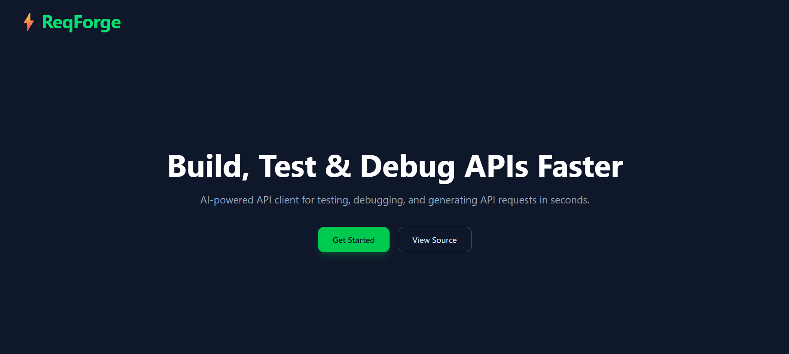
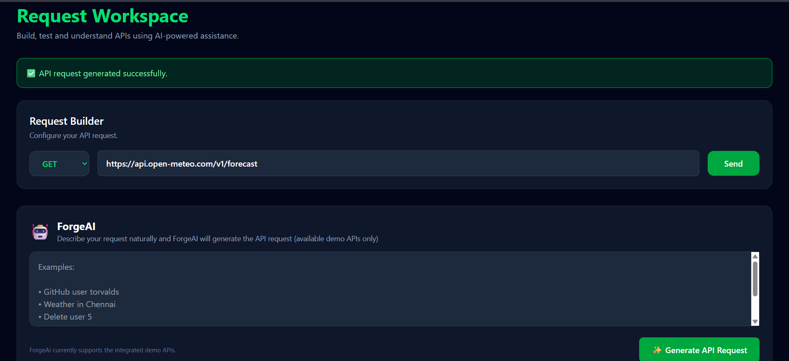
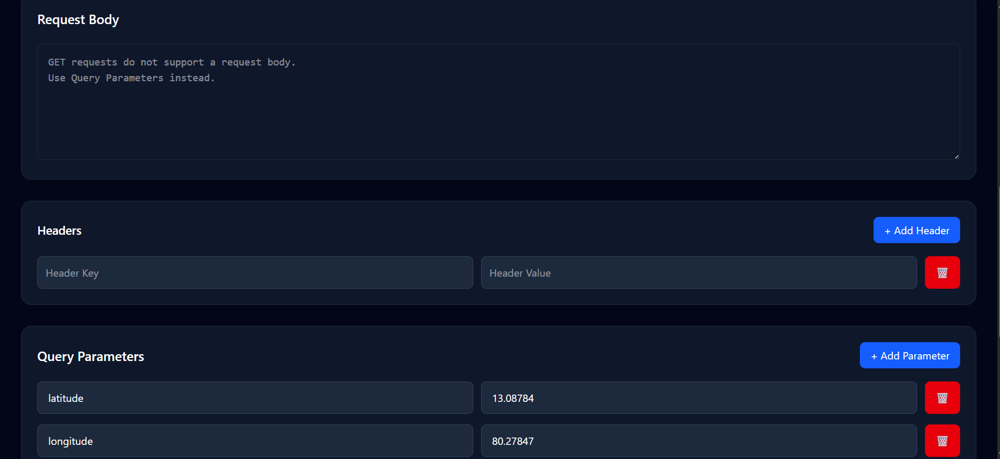
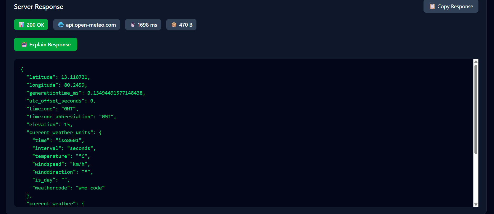
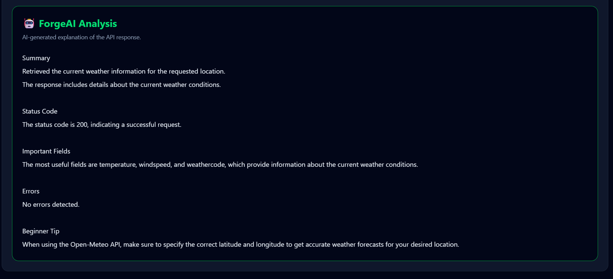
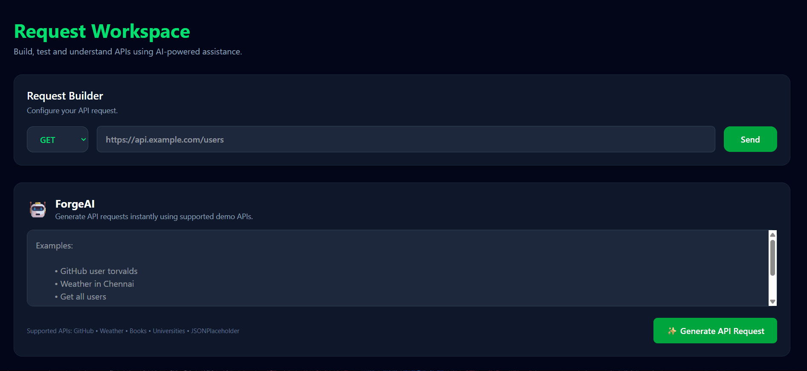

# ⚡ReqForge

> Build, test and understand REST APIs with AI-powered response explanations.

ReqForge is an AI-powered API testing platform designed to simplify API exploration for developers and beginners.

It combines a traditional API testing workspace with **ForgeAI**, allowing users to quickly generate supported API requests and receive AI-powered explanations of server responses in simple language.

---

## 🚀 Features

- 🤖 ForgeAI-assisted API request generation (supported demo APIs)
- 📖 AI-powered server response explanations
- 🌐 Send HTTP requests (GET, POST, PUT, DELETE)
- 📝 Dynamic Request Headers
- 🔍 Dynamic Query Parameters
- 📦 JSON Request Body Editor
- 📊 Response Viewer
- 📍 Weather location detection
- ⏱ Response Time Indicator
- 📋 Copy Response & AI Analysis
- 🌙 Modern responsive UI

---

## 🖼️ Screenshots

### Landing Page

> 

### ForgeAI

> 

### Generated Request

> 

### Server Response

> 

### ForgeAI Analysis

> 

## 🎥 Demo

> 
---

## 🛠 Tech Stack

### Frontend

- React
- React Router
- Tailwind CSS
- Vite

### Backend

- Node.js
- Express.js
- Axios

### AI

- Groq API
- Llama 3.3 70B Versatile

### APIs Used

- GitHub API
- Open-Meteo API
- Open Library API
- Hipolabs Universities API
- JSONPlaceholder

---

## ⚙️ Installation

### Clone Repository

```bash
git clone https://github.com/Kenaz63/reqforge
```

### Install Frontend

```bash
cd client
npm install
npm run dev
```

### Install Backend

```bash
cd server
npm install
npm run dev
```

---

## 🔑 Environment Variables

Create a `.env` file inside the `server` folder.

```env
GROQ_API_KEY=your_groq_api_key_here
```

---

## 🔄 Workflow

1. Generate an API request with ForgeAI or build one manually.
2. Configure headers, query parameters or request body.
3. Send the request.
4. Inspect the server response.
5. Let ForgeAI explain the response in beginner-friendly language.

## 📂 Project Structure

```
ReqForge/
│
├── client/
│   ├── src/
│   ├── components/
│   ├── pages/
│   └── ...
│
├── server/
│   ├── services/
│   ├── app.js
│   └── ...
│
└── README.md
```

---

## 👨‍💻 Author

**Kenaz**

LinkedIn: https://www.linkedin.com/in/kenaz-p-saji-124859225/

